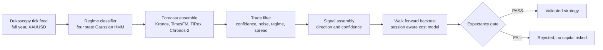

<h1 align="center">⚡ Kairos Engine</h1>

<p align="center"><em>A quantitative strategy validation pipeline. Find the opportune moment, or prove it does not exist.</em></p>

<p align="center">
  
  
</p>

<p align="center">Built by Mohamad Omar · USTechai · <a href="https://www.ustechai.com">https://www.ustechai.com</a></p>

<br>

> In ancient Greek there were two words for time. Chronos is the steady tick of the clock, one second following another, indifferent to what happens inside it. Kairos is different. Kairos is the moment that matters, the narrow opening where timing itself becomes the edge. Markets run mostly on chronos: noise, drift, cost, and the slow grind of the session clock. Somewhere inside that noise, sometimes, there is kairos. This engine exists to find it, and to prove honestly when it is not there.

## What it does

Kairos Engine is an end to end quantitative research platform for scalping signals in FX and metals markets. It ingests raw tick data, classifies market regime with a statistical model, evaluates an ensemble of modern time series foundation models, and puts every candidate strategy through a strict walk forward backtest against a broker cost model built from real measured spreads. Nothing graduates from this pipeline without clearing an explicit expectancy gate: profit net of every cost, evaluated out of sample, over a trade count large enough to mean something.

The platform has processed a full year of tick level XAUUSD data, fit and validated a four state Hidden Markov regime classifier, evaluated four separate time series foundation models as a forecast ensemble, and walk forward tested a validated strategy variant across 221 trades over 365 days with full per regime performance attribution. One variant passed every gate. Several did not. Both outcomes are the point.

A validation pipeline that only ever says yes is not a validation pipeline, it is a marketing document. The value of this engine is as much in what it rejects as in what it approves. Several approaches were built, tested, and killed in this repository before a single variant survived contact with real cost. This engine kills bad strategies before they cost real money, and that capability is the whole product.

## Architecture



Every stage above is real, tested code, not a diagram of an intention. The feed layer pulls raw tick data from Dukascopy and reconstructs minute bars with genuine measured spread rather than a synthetic estimate. The regime classifier is a four state Gaussian Hidden Markov Model, refit on a rolling walk forward schedule so it never sees the future when labeling the past. The forecast ensemble runs four independent time series foundation models, Kronos, TimesFM, TiRex, and Chronos-2, and blends their output with a confidence weighted vote. The cost model prices every trade using session aware spread, slippage, commission, and swap, calibrated against live broker quotes rather than a textbook assumption, using hmmlearn for the regime fit and a pure Python Dukascopy client for data. Nothing reaches the expectancy gate without surviving all of it.

## Validated findings

| Approach tested | Sample | Result | Verdict |
|---|---|---|---|
| Four model forecast ensemble, ten minute horizon | 4,929 signals, 90 days, XAUUSD | Predicted direction showed near zero correlation with realized direction | FAIL, no exploitable edge |
| Mean reversion strategy, one minute bars, multiple stop widths | 700+ trades per variant, 90 days | Negative expectancy before any cost was applied, consistent across every stop width tested | FAIL |
| Same strategy, fifteen minute and one hour bars | 12 to 40 trades, 90 days | Negative expectancy | FAIL |
| Same strategy, five minute bars, tightest stop | 221 trades, 365 days | Positive expectancy before and after confirmed broker costs | **PASS** |

The validated variant cleared every gate under confirmed broker costs, with a gross to cost multiple of 16x against a required minimum of 1.5x. Gross expectancy came in at plus 246.91 pips per trade, and net expectancy after confirmed real broker spread and commission held at plus 222.91 pips per trade, across a full year and 221 trades, well past this project's own significance floor of 100 trades.

Per regime performance attribution on the validated variant, using confirmed broker costs:

| Regime | Trades | Net expectancy per trade |
|---|---:|---:|
| Breakout | 48 | +1,411.6 pips |
| Trend | 56 | +243.2 pips |
| Chop | 52 | (51.1) pips |
| Cascade | 63 | (479.7) pips |

Trend flips from a loser to a winner once real, confirmed costs replace an assumed cost figure. Cascade stays negative in every cost scenario tested and is the one regime this variant should not trade.

## Quick start

```bash
./setup.sh --pretrain-hmm
python scripts/replay_backtest.py --report-only
python scripts/backtest_manual_bb_strategy.py --days 90
python scripts/cost_scenario_report.py
```

The setup script builds the virtual environment, clones the forecasting model repositories the ensemble depends on, and pretrains the regime classifier on historical bars. Each script documents its own assumptions in its module docstring. Read those before trusting any single number out of context.

## Disclaimer

Every result in this repository is a rigorous backtest. A backtest is a historical simulation, not a live trading record, and no capital, real or otherwise, has been risked on any finding described here. Past performance in a backtest does not guarantee future results. Kairos Engine is research software, provided for educational and research purposes only. Nothing in this repository is financial advice, and nothing here should be read as a recommendation to buy, sell, or hold any instrument.

## License

Kairos Engine is released under the MIT License. See [LICENSE](LICENSE) for full terms.

<p align="center">© 2026 Mohamad Omar · <a href="https://www.ustechai.com">USTechai</a></p>
